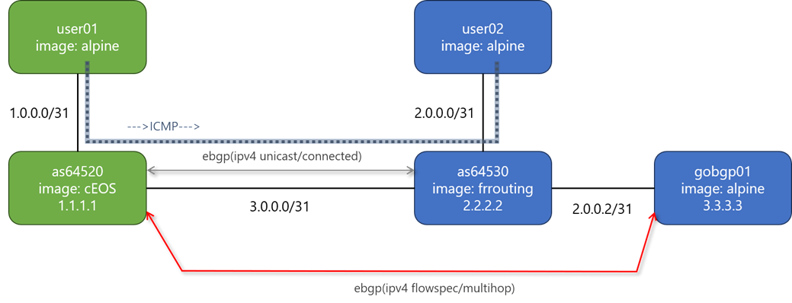

# Containerlab BGP & Flowspec Lab

This lab provides a lightweight environment for testing **eBGP (IPv4 unicast/connected)**  
and **eBGP Flowspec (multihop)** using containerlab.  
It combines FRRouting, cEOS, and Alpine nodes to validate routing behavior,  
Flowspec rule propagation, and basic traffic filtering.

---

## 📘 Topology

The lab consists of five nodes forming two eBGP adjacencies and one multihop Flowspec session.

---

## 🧩 Node Overview

| Node       | Image          | Purpose |
|------------|----------------|---------|
| **user01** | alpine         | Test host on AS64520 side |
| **user02** | alpine         | Test host on AS64530 side |
| **as64520** | cEOS (1.1.1.1) | eBGP router / Flowspec receiver |
| **as64530** | FRRouting (2.2.2.2) | eBGP peer |
| **gobgp01** | alpine (3.3.3.3) | GoBGP Flowspec injector |

---

## 🔗 BGP Sessions

### **1. eBGP (IPv4 Unicast / Connected)**
- **AS64520 ↔ AS64530**
- Directly connected
- Exchanges IPv4 unicast routes

### **2. eBGP (IPv4 Flowspec / Multihop)**
- **AS64520 ↔ gobgp01**
- Multihop eBGP
- Used to inject and validate Flowspec rules

---

## Notes
- Flowspec rules can be injected from gobgp01 and verified on as64520 (cEOS).
- user01 and user02 can be used to generate ICMP traffic to observe filtering behavior.
- The lab is intentionally minimal to keep iteration fast and debugging simple.

